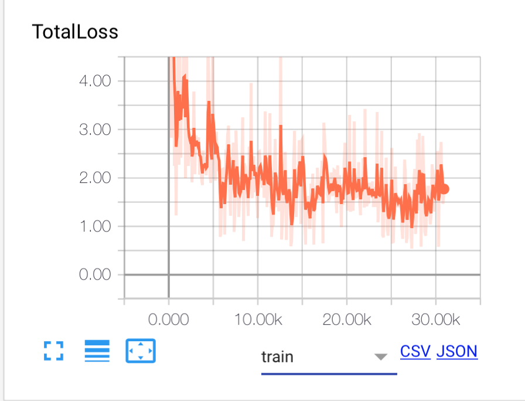
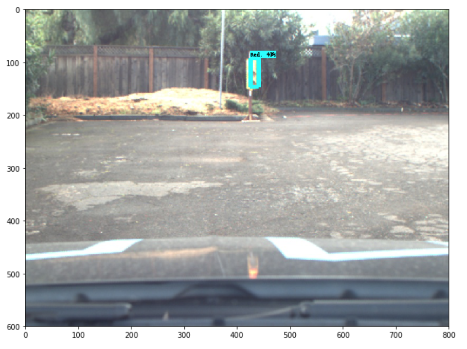
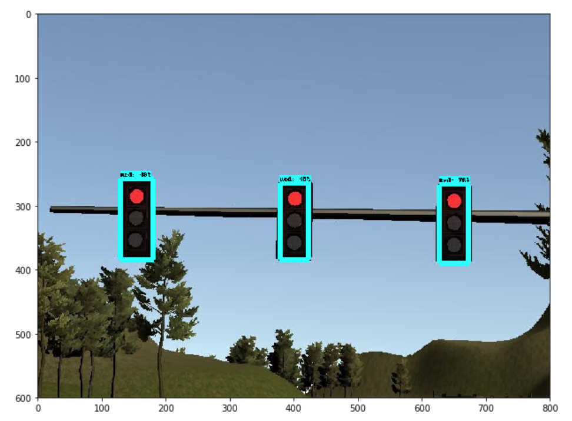
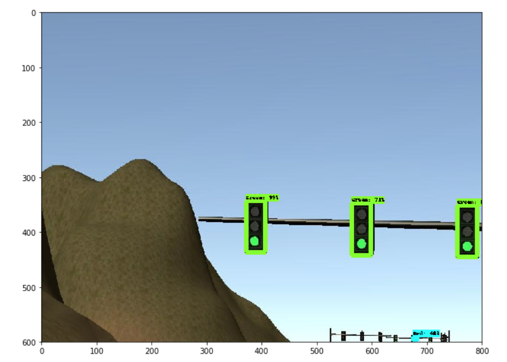
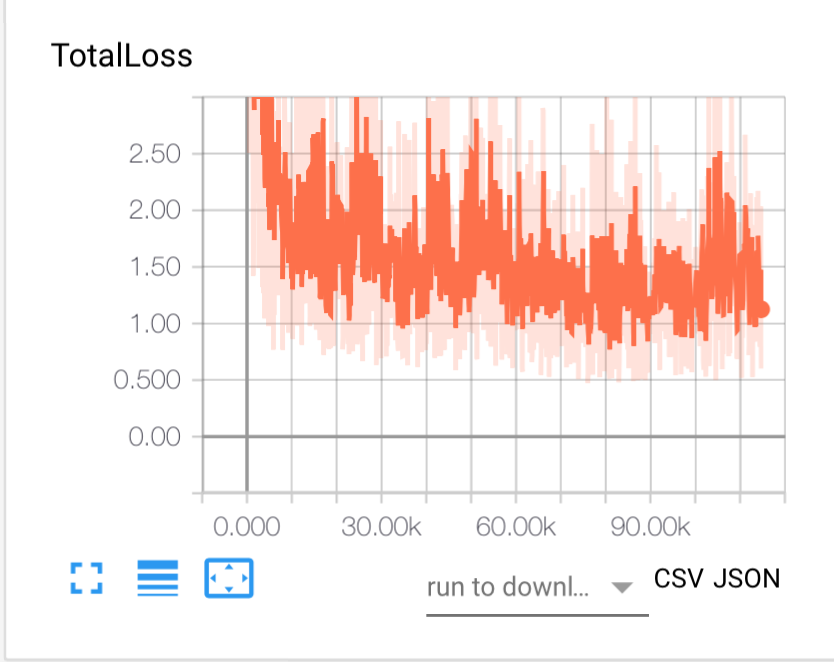
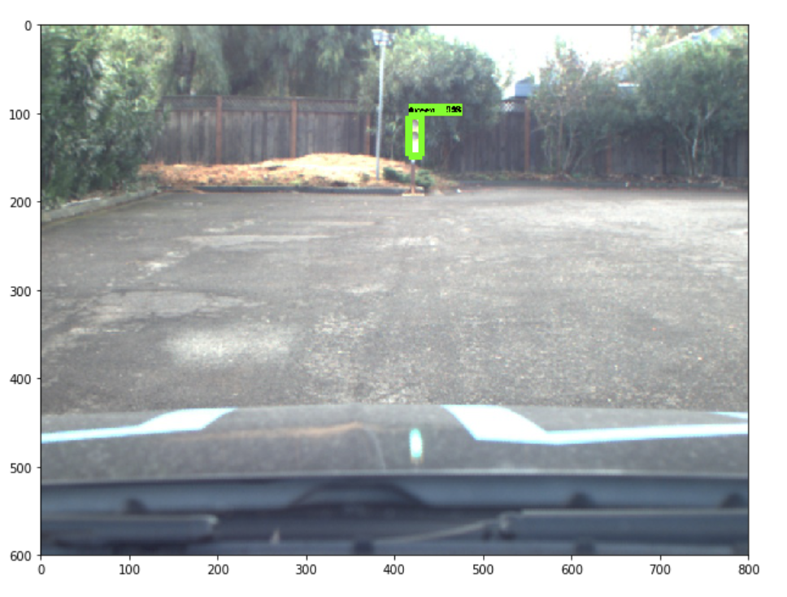
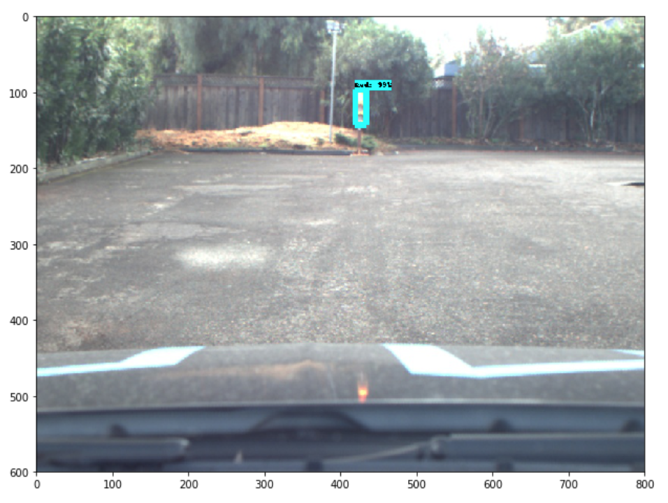
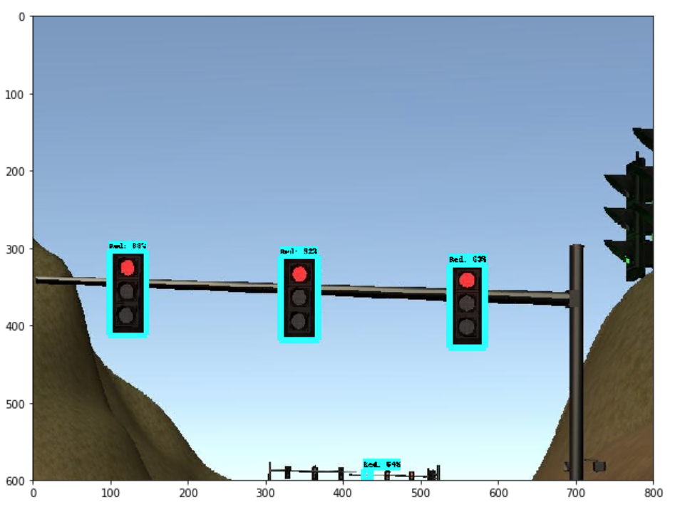
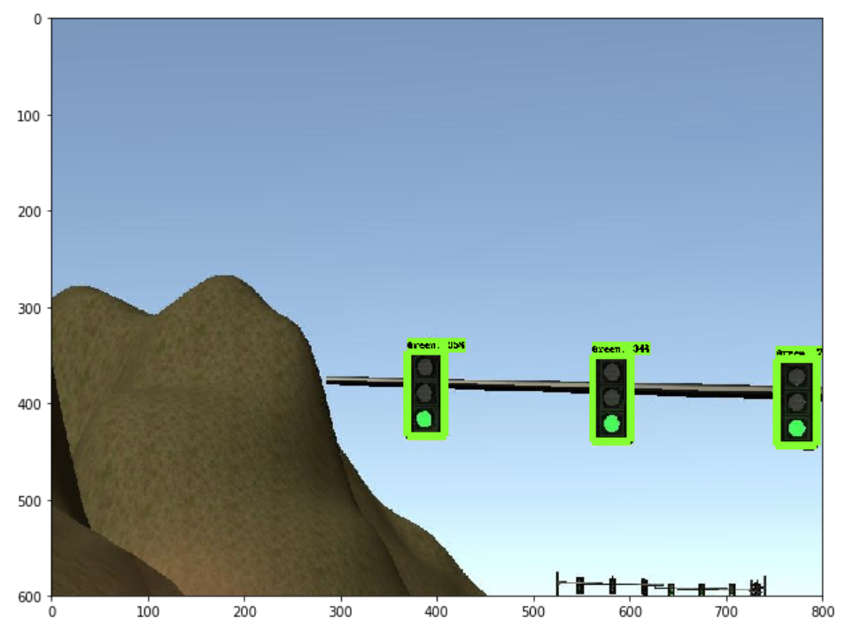

# Traffic Light Classifier Models 
This document provides an overview of all the models our team used to classify traffic lights.

[//]: # (Image References)
[image_ssd_sim]: ./imgs/ssd_inception_simul.JPG "Classification using SSD Inception V2 over simulation data"
[image_ssd_reallife]: ./imgs/ssd_inception_reallife.JPG "Classification using SSD Inception V2 over real life data"
[image1]: ./imgs/real1.png
[image2]: ./imgs/real2.png
[image3]: ./imgs/real3.png
[image4]: ./imgs/sim1.png
[image5]: ./imgs/Loss_real.png
[image6]: ./imgs/loss_sim.png
[loss_24_03_2018]: ./imgs/ssd_sim_and_real_24_03_2018/loss.png
[real_red_24_03_2018]: ./imgs/ssd_sim_and_real_24_03_2018/reallife_red.png
[sim_green_24_03_2018]: ./imgs/ssd_sim_and_real_24_03_2018/sim_green.png
[sim_red_24_03_2018]: ./imgs/ssd_sim_and_real_24_03_2018/sim_red.png
[loss_30_03_2018]: ./imgs/ssd_sim_and_real_30_03_2018/loss.png
[real_red_30_03_2018]: ./imgs/ssd_sim_and_real_30_03_2018/reallife_red.png
[real_green_30_03_2018]: ./imgs/ssd_sim_and_real_30_03_2018/reallife_green.png
[sim_green_30_03_2018]: ./imgs/ssd_sim_and_real_30_03_2018/sim_green.png
[sim_red_30_03_2018]: ./imgs/ssd_sim_and_real_30_03_2018/sim_red.png

## List of Models
1. **[faster_rcnn_sim](#faster_rcnn_sim)**
2. **[faster_rcnn_reallife](#faster_rcnn_reallife)**
3. **[ssd_inception_v2_coco_sim](#ssd_inception_v2_coco_sim)**
4. **[ssd_inception_v2_coco_reallife](#ssd_inception_v2_coco_reallife)**
5. **[ssd_sim_and_real_24_03_2018](#ssd_sim_and_real_24_03_2018-ssd_inception_v2_coco)**
6. **[ssd_sim_and_real_30_03_2018](#ssd_sim_and_real_30_03_2018-ssd_inception_v2_coco)**

## Model Details
### faster_rcnn_sim
This model is optimized to classify simulator images. This model is based on [Faster R-CNN Resnet 101](https://papers.nips.cc/paper/5638-faster-r-cnn-towards-real-time-object-detection-with-region-proposal-networks.pdf) model architecture and created using TensorFlow's Object Detection API. Model is first trained using [Bosch Small traffic Light Data set](https://hci.iwr.uni-heidelberg.de/node/6132) and then fine tuned for a hand annotated set of images from the Udacity Simulator.
#### Model Params:
epochs : 10000
learning rate : 0.0003

#### Loss Graph
![alt text][image6] 

#### Few Inference Images

![alt text][image4]

### faster_rcnn_reallife
This model is optimized to classify reallife traffic light images. This model is based on [Faster R-CNN Resnet 101](https://papers.nips.cc/paper/5638-faster-r-cnn-towards-real-time-object-detection-with-region-proposal-networks.pdf) model architecture and created using TensorFlow's Object Detection API. Model is first trained using [Bosch Small traffic Light Data set](https://hci.iwr.uni-heidelberg.de/node/6132) and then fine tuned for a hand annotated set of images from the Udacity test track.
#### Model Params:
epochs : 10000
learning rate : 0.0003

#### Loss Graph
![alt text][image5] 

#### Few Inference Images

![alt text][image1] | ![alt text][image2] | ![alt text][image3]

### ssd_inception_v2_coco_sim
This model is designed to classify simulator images. This model is based on [SSD inception v2](https://arxiv.org/pdf/1502.03167) model architecture and created using TensorFlow's object detection API. It is trained using a hand annotated set of images from the Udacity Simulator.
#### Model params:
epochs : 5000
learning rate : 0.004 
![alt text][image_ssd_sim]

### ssd_inception_v2_coco_reallife
This model is designed to classify reallife traffic light images. This model is based on [SSD inception v2](https://arxiv.org/pdf/1502.03167) model architecture and created using TensorFlow's object detection API. It is trained using a hand annotated set of images from the Udacity test track.
#### Model params:
epochs : 5000
learning rate : 0.004
![alt text][image_ssd_reallife]

### ssd_sim_and_real_24_03_2018 ssd_inception_v2_coco
This model is designed to classify both reallife and simulator traffic light images. This model is based on [SSD inception v2](https://arxiv.org/pdf/1502.03167) model architecture and created using TensorFlow's object detection API. It is trained using a hand annotated set of images from [the Udacity test track](https://carnd.slack.com/files/U5FLANLA2/F9SMHKS6M/dataset-sdcnd-capstone.zip), as well as using [Bosch Small traffic Light Data set](https://hci.iwr.uni-heidelberg.de/node/6132)
#### Model params:
epochs : +30k
learning rate : 0.004

#### Loss Graph

#### Few Inference Images

### ssd_sim_and_real_30_03_2018 ssd_inception_v2_coco
This model is designed to classify both reallife and simulator traffic light images. This model is based on [SSD inception v2](https://arxiv.org/pdf/1502.03167) model architecture and created using TensorFlow's object detection API. It is trained using a hand annotated set of images from [the Udacity test track](https://carnd.slack.com/files/U5FLANLA2/F9SMHKS6M/dataset-sdcnd-capstone.zip), [Bosch Small traffic Light Data set](https://hci.iwr.uni-heidelberg.de/node/6132), as well as [hand annotated by sloth images](./data/traffic_light_bag_images_part1.tgz)
#### Model params:
epochs : +100k
learning rate : 0.004

#### Loss Graph

#### Few Inference Images

